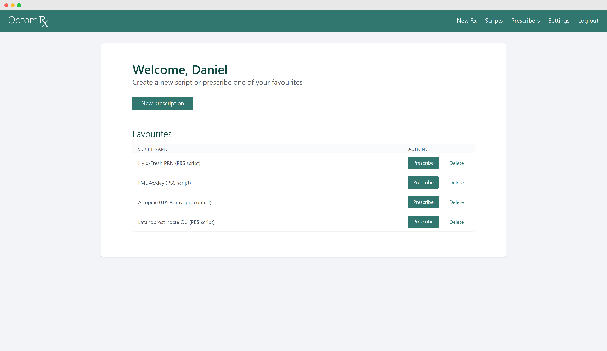

  <br /> 
<div align="center">
  <a href="https://optomrx.net">
    
  </a>
  <br /> 
  <br /> 
  
  <p align="center">
    Online therapeutic prescriptions for Australian optometrists
    <br />
    <a href="https://optomrx.net"><strong>Visit the website »</strong></a>
    <br />
    <br />
    <a href="https://github.com/daniel-moderiano/optom-rx/issues/new?assignees=&labels=&template=bug_report.md&title=">Report Bug</a>
    ·
    <a href="https://github.com/daniel-moderiano/optom-rx/issues/new?assignees=&labels=&template=feature_request.md&title=">Request Feature</a>
  </p>
</div>


## About the project

[OptomRx](https://optomrx.net) is an industry-first web app for Australian optometrists to create and manage professional therapeutic prescriptions online. It supports the full suite of PBS and non-PBS medications available to therapeutically endorsed optometrists.  




OptomRx is designed for use with official PBS computerised forms for optometrists. These forms can be ordered in bulk, at no charge from [Services Australia](https://www.servicesaustralia.gov.au/pbs-and-rpbs-stationery-for-optometrists?context=22851).

### Features

* **Real-time PBS data:** receive PBS information about your selected medication as your write the prescription. This includes criteria for PBS, max quantity/repeats, and authority information.
* **Active ingredient prescribing:** automatically adjust your prescription format to meet guidelines for active ingredient prescribing, including support for the List of Excluded Medicinal Items (LEMI) and the List of Medicinal Items for Brand Consideration (LMBC).
* **Instant re-prescribe:** save any scripts as 'favourites' for quick one-click re-prescribe functionality. Favourites include all medicine details, so just add patient details, and the script is done. Quick and easy.
* **Multiple prescribers:** OptomRx supports as many prescriber profiles as you need. Perfect for locum work, or those at a single practice only. Switch between prescriber details as needed for each script.
* **No patient data retention:** patient information is never saved on OptomRx. When you save a script, only non-identifiable information regarding medication and PBS details are retained. OptomRx was and is designed as a prescription writing tool, not a prescription database.

### Technologies used

* [React](https://reactjs.org/) - Front-end JS framework
* [Firebase](https://maven.apache.org/) - Back-end as a service (authentication, database, and hosting)
* [Styled components](https://styled-components.com/) - App-wide custom styling


## Usage

These instructions will get you a copy of the project up and running on your local machine for development and testing purposes. 

### Requirements

A valid Google Places API key is required for Google's autocomplete functionality.

### Installing

First, clone the repository

```
git clone git@github.com:daniel-moderiano/optom-rx.git
```

Inside the root directory, install all dependencies with npm

```
npm install
```

Finally, use the following to spin up the project on a development server

```
npm start
```

*Occasionally issues arise with the Content-Security-Policy when saving new styling or other content, and this can prevent the site from functioning correctly without page refresh. This can be solved by refreshing the page, or by temporarily commenting out the CSP in the `public/index.html` file. This must be reset to normal before pushing new changes however.*

## License

This project is licensed under the MIT License - see the [LICENSE.md](https://github.com/daniel-moderiano/optom-rx/blob/main/LICENSE) file for details.  
Authored and maintained by Daniel Moderiano.

## Acknowledgments

The following resources were a great help throughout the development of OptomRx.

* [Copy & Paste CSS](https://copy-paste-css.com/)
* [Paginated Tables in React](https://dev.to/franciscomendes10866/how-to-create-a-table-with-pagination-in-react-4lpd)
* [Responsive Tables with CSS](https://css-tricks.com/making-tables-responsive-with-minimal-css/)
* [Web accessibility tutorials](https://www.w3.org/WAI/tutorials/)
* [The Net Ninja](https://www.youtube.com/channel/UCW5YeuERMmlnqo4oq8vwUpg)

Finally, a special thanks to Sarah Smoker for her invaluable design and UI/UX ideas, and endless QA testing.
